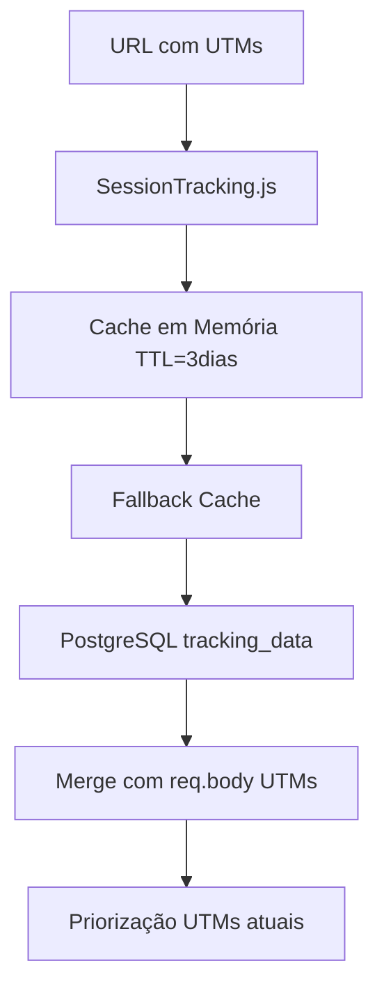

# 🚨 ANÁLISE TÉCNICA COMPLETA: Sistema de Tracking HotBot WebV2

## 📋 ARQUITETURA GERAL

O sistema possui uma arquitetura **dual-module** com tracking avançado implementado em dois módulos independentes:

1. **Bot Telegram** (`MODELO1/`) - Backend com webhook PushinPay
2. **Privacy System** (`privacy---sync/`) - Checkout web com redirecionamento

Ambos compartilham o mesmo **PostgreSQL** como storage central e implementam tracking **multi-plataforma** (Facebook + Kwai + UTMify).

---

## 🤖 MÓDULO 1: BOT TELEGRAM - ANÁLISE DETALHADA

### ⚡ **Gatilhos de Eventos**

```javascript
// 1. LEAD CAPTURE (Primeiro contato)
// Trigger: Usuário inicia conversa com bot
// Local: TelegramBotService.js:165-316
// Dados: telegram_id, fbp, fbc, ip, user_agent, UTMs
```

```javascript
// 2. ADD_TO_CART (Geração de PIX)
// Trigger: _executarGerarCobranca() linha 729
// Local: TelegramBotService.js:841-1192
// Dados: valor, produto, tracking_data completo
```

```javascript  
// 3. PURCHASE (Pagamento aprovado)
// Trigger: webhookPushinPay() linha 1199
// Local: TelegramBotService.js:1199-1432
// Dados: valor_pago, payer_data, external_id_hash
```

### 🔄 **Fluxo de Captura UTM**



**Pontos críticos identificados:**
- ✅ **Priorização correta**: UTMs da requisição atual sobrescrevem dados salvos
- ✅ **Triple storage**: SessionTracking → Cache → PostgreSQL  
- ✅ **Merge inteligente**: `mergeTrackingData()` com lógica de prioridade
- ⚠️ **Gap potencial**: UTMs podem ser perdidos se SessionTracking expira antes da conversão

### 📊 **Storage PostgreSQL - Schema Completo**

```sql
-- Tabela principal de tokens/transações
CREATE TABLE tokens (
  id_transacao TEXT PRIMARY KEY,
  telegram_id TEXT,
  valor NUMERIC,
  
  -- UTM Parameters  
  utm_source TEXT,
  utm_medium TEXT, 
  utm_campaign TEXT,
  utm_term TEXT,
  utm_content TEXT,
  
  -- Facebook Tracking
  fbp TEXT,
  fbc TEXT,
  external_id_hash TEXT,
  
  -- Event Control Flags (Deduplicação)
  pixel_sent BOOLEAN DEFAULT FALSE,
  capi_sent BOOLEAN DEFAULT FALSE, 
  cron_sent BOOLEAN DEFAULT FALSE,
  event_attempts INTEGER DEFAULT 0,
  first_event_sent_at TIMESTAMP,
  
  -- Metadata
  ip_criacao TEXT,
  user_agent_criacao TEXT,
  criado_em TIMESTAMP DEFAULT NOW()
);

-- Tabela de tracking separada
CREATE TABLE tracking_data (
  telegram_id BIGINT PRIMARY KEY,
  utm_source TEXT,
  utm_medium TEXT,
  utm_campaign TEXT, 
  utm_term TEXT,
  utm_content TEXT,
  fbp TEXT,
  fbc TEXT,
  ip TEXT,
  user_agent TEXT,
  created_at TIMESTAMP DEFAULT CURRENT_TIMESTAMP
);
```

### 🎯 **Integração Facebook Pixel + CAPI**

**Deduplicação via event_id:**
```javascript
// services/facebook.js:174-179
let finalEventId = event_id;
if (!finalEventId) {
  finalEventId = generateEventId(event_name, telegram_id || token || '', event_time);
  console.log(`⚠️ event_id não fornecido. Gerado automaticamente: ${finalEventId}`);
}
```

**Validação robusta AddToCart:**
```javascript
// Requer pelo menos 2 parâmetros: fbp, fbc, ip, user_agent, external_id
const requiredParams = ['fbp', 'fbc', 'client_ip_address', 'client_user_agent', 'external_id'];
const availableParams = requiredParams.filter(param => user_data[param]);

if (availableParams.length < 2) {
  return { success: false, error: 'Parâmetros insuficientes para AddToCart' };
}
```

---

## 🌐 MÓDULO 2: PRIVACY SYSTEM - ANÁLISE DETALHADA

### ⚡ **Gatilhos de Eventos**

```javascript
// 1. CONTENT_VIEW (Landing page)
// Trigger: DOMContentLoaded
// Local: kwai-click-tracker.js:238-288
// Dados: click_id, page_title, UTMs
```

```javascript
// 2. ADD_TO_CART (PIX Creation)  
// Trigger: Sistema de pagamento
// Local: universal-payment-integration.js
// Dados: valor, produto, click_id
```

```javascript
// 3. PURCHASE (Webhook)
// Trigger: pushinpayWebhook.js:136-195
// Local: Webhook PushinPay
// Dados: valor_pago, payer_data, end_to_end_id
```

### 🔄 **Sistema Kwai Click Tracking**

```javascript
// privacy---sync/public/js/kwai-click-tracker.js
// Captura automática de click_id
function captureClickId() {
  const urlParams = new URLSearchParams(window.location.search);
  let clickId = urlParams.get('click_id') || urlParams.get('kwai_click_id');
  
  if (clickId) {
    // Triple storage para persistência
    localStorage.setItem('kwai_click_id', clickId);
    sessionStorage.setItem('kwai_click_id', clickId);
    localStorage.setItem('kwai_tracking_data', JSON.stringify(trackingData));
  }
  
  return clickId;
}
```

**Persistência entre páginas:**
- ✅ `localStorage` + `sessionStorage` para redundância
- ✅ Recuperação automática em páginas subsequentes  
- ✅ Debug mode detalhado para troubleshooting

### 📡 **APIs Externas - Análise de Integração**

**1. Kwai Events API:**
```javascript
// services/kwaiEventAPI.js:49-113
// Integração SÍNCRONA com timeout 10s
const response = await axios.post(this.baseUrl, payload, {
  headers: {
    'Content-Type': 'application/json',
    'Accept': 'application/json;charset=utf-8'
  },
  timeout: 10000 // ⚠️ Potencial bottleneck
});
```

**2. UTMify Integration:**
```javascript
// services/utmify.js:66-154  
// Integração SÍNCRONA - sem retry logic
const res = await axios.post(
  'https://api.utmify.com.br/api-credentials/orders',
  payload,
  { headers: { 'x-api-token': process.env.UTMIFY_API_TOKEN } }
);
```

---

## 🔍 GAPS E PROBLEMAS IDENTIFICADOS

### ❌ **1. DUPLICAÇÃO DE EVENTOS KWAI** 
**Problema:** EVENT_PURCHASE enviado 2x
- Webhook PushinPay ✅ (correto)
- Página compra-aprovada ❌ (removido)

**Solução implementada:** 
```javascript
// EVENT_DUPLICATION_SOLUTION.md
// Webhook = fonte única de verdade
// Página = apenas status informativo
```

### ⚠️ **2. PERDA DE DADOS ENTRE MÓDULOS**

**Gap crítico:** Dados não persistem ao navegar bot → web
```javascript
// Bot armazena em PostgreSQL tracking_data
// Web usa localStorage/sessionStorage  
// ❌ Não há bridge entre os dois sistemas
```

**Impacto:** 
- UTMs capturados no bot podem ser perdidos no checkout web
- Facebook cookies não compartilhados entre módulos
- Quebra na continuidade do tracking

### ⚠️ **3. DELAYS DE SINCRONIZAÇÃO**

**Facebook CAPI:**
```javascript
// timestamp-sync.js:19-67
// Sincronização manual de timestamp
// ⚠️ Delay potencial entre Pixel e CAPI
```

**APIs externas:**
- Kwai: timeout 10s (síncrono) 
- UTMify: sem timeout definido
- Facebook: sem retry logic

### ⚠️ **4. VALIDAÇÃO UTM INCONSISTENTE**

```javascript
// Formato esperado: "nome|id"  
// trackingValidation.js:37-64
function processUTMForUtmify(utmValue) {
  const parts = decoded.split('|');
  if (parts.length >= 2 && /^\d+$/.test(id)) {
    return { name, id, formatted };
  }
  // ⚠️ Fallback pode gerar dados inconsistentes
}
```

---

## 📊 MAPEAMENTO COMPLETO DE EVENTOS

### **BOT TELEGRAM**

| Evento | Trigger | Local | Dados Coletados | APIs Acionadas |
|--------|---------|-------|-----------------|----------------|
| **Lead** | Primeiro contato | `TelegramBotService:165` | `telegram_id`, `utm_*`, `fbp`, `fbc` | Facebook CAPI |
| **AddToCart** | Gerar PIX | `TelegramBotService:729` | `valor`, `produto`, `tracking_data` | Facebook CAPI |
| **Purchase** | Webhook aprovado | `TelegramBotService:1199` | `valor_pago`, `payer_hash` | Facebook CAPI + UTMify |

### **PRIVACY SYSTEM**  

| Evento | Trigger | Local | Dados Coletados | APIs Acionadas |
|--------|---------|-------|-----------------|----------------|
| **ContentView** | Page load | `kwai-click-tracker:238` | `click_id`, `page_title` | Kwai Events |
| **AddToCart** | PIX creation | `universal-payment:150` | `valor`, `click_id` | Kwai Events |
| **Purchase** | Webhook | `pushinpayWebhook:136` | `valor_pago`, `click_id` | Kwai Events |

---

## 🎯 ESTRATÉGIA DE DEDUPLICAÇÃO

### **Facebook (Pixel + CAPI)**
✅ **Implementado corretamente:**
```javascript
// Mesmo event_id para Pixel e CAPI
const eventId = token; // Usar transaction token
fbq('track', 'Purchase', { eventID: eventId });
sendFacebookEvent({ event_id: eventId });
```

### **Kwai Events**  
✅ **Sem duplicação:**
- Webhook = fonte única para Purchase
- Página = apenas informativa

### **UTMify**
⚠️ **Potencial duplicação:**
- Enviado apenas no webhook bot
- Não há controle se Privacy também envia

---

## 🔧 RECOMENDAÇÕES TÉCNICAS DE OTIMIZAÇÃO

### 🚀 **1. PERFORMANCE**

#### **Cache UTM Avançado**
```javascript
// Implementar Redis para cache distribuído
const redis = require('redis');
const client = redis.createClient();

// Cache UTM com TTL inteligente
async function cacheUTMData(telegram_id, utmData) {
  const key = `utm:${telegram_id}`;
  const ttl = 7 * 24 * 3600; // 7 dias
  
  await client.setex(key, ttl, JSON.stringify(utmData));
  
  // Backup em PostgreSQL apenas se dados críticos
  if (utmData.utm_campaign && utmData.utm_source) {
    await saveToPostgreSQL(telegram_id, utmData);
  }
}
```

#### **Eventos em Batch**
```javascript
// Queue system para eventos não-críticos
const EventQueue = require('bull');
const eventQueue = new EventQueue('tracking events', process.env.REDIS_URL);

// Batch processing a cada 30 segundos
eventQueue.process('facebook-batch', async (job) => {
  const events = job.data.events;
  
  // Enviar múltiplos eventos em uma requisição
  await sendFacebookBatch(events);
});

// Adicionar evento ao batch
function queueFacebookEvent(eventData) {
  eventQueue.add('facebook-batch', { events: [eventData] }, {
    delay: 30000, // 30s delay para batching
    attempts: 3
  });
}
```

### 👤 **2. TRACKING INVISÍVEL**

#### **Fingerprinting Avançado**
```javascript
// Gerar ID único do dispositivo
function generateDeviceFingerprint() {
  const canvas = document.createElement('canvas');
  const ctx = canvas.getContext('2d');
  ctx.textBaseline = 'top';
  ctx.font = '14px Arial';
  ctx.fillText('Device fingerprint', 2, 2);
  
  const fingerprint = {
    canvas: canvas.toDataURL(),
    screen: `${screen.width}x${screen.height}`,
    timezone: Intl.DateTimeFormat().resolvedOptions().timeZone,
    language: navigator.language,
    platform: navigator.platform,
    cookieEnabled: navigator.cookieEnabled,
    doNotTrack: navigator.doNotTrack
  };
  
  return btoa(JSON.stringify(fingerprint));
}
```

#### **Session Bridge Bot ↔ Web**
```javascript
// API para bridge de dados entre módulos
app.post('/api/bridge-session', async (req, res) => {
  const { telegram_id, session_token } = req.body;
  
  // Buscar dados completos do bot
  const botData = await pool.query(
    'SELECT * FROM tracking_data WHERE telegram_id = $1',
    [telegram_id]
  );
  
  // Gerar token temporário para web
  const bridgeToken = jwt.sign({
    telegram_id,
    tracking_data: botData.rows[0],
    expires: Date.now() + 300000 // 5 minutos
  }, process.env.JWT_SECRET);
  
  res.json({ bridge_token: bridgeToken });
});

// No frontend web
async function loadBotTrackingData() {
  const urlParams = new URLSearchParams(window.location.search);
  const bridgeToken = urlParams.get('bt'); // bridge token
  
  if (bridgeToken) {
    const response = await fetch('/api/decode-bridge', {
      method: 'POST',
      body: JSON.stringify({ token: bridgeToken })
    });
    
    const data = await response.json();
    // Aplicar dados do bot ao tracking web
    applyBotTrackingData(data.tracking_data);
  }
}
```

### 🎯 **3. CONVERSÃO DE LEADS OCULTOS**

#### **Event Prediction**
```javascript
// Predizer conversão baseado em comportamento
function predictConversion(userBehavior) {
  const signals = {
    timeOnPage: userBehavior.timeOnPage > 60000, // 1 minuto
    scrollDepth: userBehavior.scrollDepth > 0.7,  // 70% da página
    clicksCount: userBehavior.clicks > 3,
    returnVisitor: userBehavior.sessions > 1
  };
  
  const score = Object.values(signals).filter(Boolean).length;
  
  if (score >= 3) {
    // Disparar evento "lead quente"
    sendHotLeadEvent(userBehavior);
  }
}

// Tracking comportamental invisível
let behaviorData = {
  timeOnPage: 0,
  scrollDepth: 0,
  clicks: 0,
  sessions: parseInt(localStorage.getItem('session_count') || '0') + 1
};

// Atualizar a cada 10 segundos
setInterval(() => {
  behaviorData.timeOnPage += 10000;
  predictConversion(behaviorData);
}, 10000);
```

#### **Micro-Conversões**
```javascript
// Rastrear micro-eventos que indicam interesse
const microEvents = {
  'video_25_percent': { weight: 1 },
  'video_50_percent': { weight: 2 },  
  'video_75_percent': { weight: 3 },
  'form_field_focus': { weight: 1 },
  'cta_button_hover': { weight: 1 },
  'page_scroll_50': { weight: 1 }
};

function trackMicroEvent(eventName) {
  const weight = microEvents[eventName]?.weight || 0;
  let totalScore = parseInt(localStorage.getItem('micro_score') || '0');
  totalScore += weight;
  
  localStorage.setItem('micro_score', totalScore.toString());
  
  // Converter em lead quando score >= 5
  if (totalScore >= 5 && !localStorage.getItem('micro_lead_sent')) {
    sendMicroLeadEvent({ score: totalScore, events: Object.keys(microEvents) });
    localStorage.setItem('micro_lead_sent', '1');
  }
}
```

### 📊 **4. PÚBLICOS AVANÇADOS (FB + KWAI)**

#### **Custom Audiences Builder**
```javascript
// Segmentar usuários por comportamento
const audienceSegments = {
  'high_intent': {
    criteria: {
      timeOnPage: '>= 120',
      videoProgress: '>= 0.75', 
      microScore: '>= 5'
    },
    fbEventName: 'HighIntentLead'
  },
  
  'cart_abandoners': {
    criteria: {
      addToCartCount: '>= 1',
      purchaseCount: '= 0',
      daysSinceLastVisit: '<= 7'  
    },
    fbEventName: 'CartAbandoner'
  },
  
  'repeat_visitors': {
    criteria: {
      sessionCount: '>= 3',
      totalTimeOnSite: '>= 300'
    },
    fbEventName: 'RepeatVisitor'
  }
};

// Classificar usuário automaticamente
function classifyUser(userData) {
  for (const [segmentName, segment] of Object.entries(audienceSegments)) {
    if (matchesCriteria(userData, segment.criteria)) {
      // Enviar evento customizado para Facebook
      sendCustomAudienceEvent(segment.fbEventName, userData);
      
      // Marcar usuário no banco para futuras campanhas
      markUserSegment(userData.telegram_id, segmentName);
    }
  }
}
```

#### **Lookalike Optimization**
```javascript
// Otimizar dados para Lookalike Audiences
function optimizeForLookalike(conversionData) {
  const optimizedData = {
    // Dados demográficos inferidos
    age_range: inferAgeFromBehavior(conversionData.behavior),
    interests: extractInterests(conversionData.utm_campaign),
    
    // Dados comportamentais ricos
    conversion_value: conversionData.value,
    time_to_conversion: conversionData.conversion_time - conversionData.first_visit,
    engagement_score: calculateEngagementScore(conversionData),
    
    // Dados de contexto
    device_type: conversionData.user_agent_parsed.device,
    traffic_source: conversionData.utm_source,
    campaign_type: conversionData.utm_medium
  };
  
  // Enviar dados enriquecidos para Facebook
  sendEnrichedConversionData(optimizedData);
}
```

### 🔐 **5. MONITORAMENTO E ALERTAS**

#### **Real-time Tracking Health**
```javascript
// Dashboard de saúde do tracking em tempo real
const trackingHealth = {
  async checkSystemHealth() {
    const checks = {
      facebook_pixel: await this.testFacebookPixel(),
      facebook_capi: await this.testFacebookCAPI(),
      kwai_events: await this.testKwaiEvents(),
      utmify_api: await this.testUTMifyAPI(),
      database: await this.testDatabase(),
      session_tracking: await this.testSessionTracking()
    };
    
    const healthScore = Object.values(checks).filter(Boolean).length / Object.keys(checks).length;
    
    if (healthScore < 0.8) {
      await this.sendAlert(`Tracking health degraded: ${Math.round(healthScore * 100)}%`);
    }
    
    return { score: healthScore, checks };
  }
};

// Executar health check a cada 5 minutos
setInterval(() => trackingHealth.checkSystemHealth(), 300000);
```

#### **Conversion Attribution Analysis**
```javascript
// Análise de atribuição multi-touch
const attributionAnalysis = {
  async analyzeConversionPath(telegram_id) {
    const touchpoints = await pool.query(`
      SELECT event_name, timestamp, utm_source, utm_medium, utm_campaign
      FROM user_events 
      WHERE telegram_id = $1 
      ORDER BY timestamp ASC
    `, [telegram_id]);
    
    // Modelo de atribuição time-decay
    const attribution = touchpoints.rows.map((touch, index) => ({
      ...touch,
      weight: Math.pow(0.8, touchpoints.rows.length - index - 1),
      position: index === 0 ? 'first' : (index === touchpoints.rows.length - 1 ? 'last' : 'middle')
    }));
    
    return {
      first_touch: attribution[0],
      last_touch: attribution[attribution.length - 1],
      assisted_touches: attribution.slice(1, -1),
      total_weight: attribution.reduce((sum, touch) => sum + touch.weight, 0)
    };
  }
};
```

---

## 📈 MÉTRICAS DE SUCESSO RECOMENDADAS

### **KPIs Técnicos**
- **Event Delivery Rate**: > 98%
- **Attribution Accuracy**: > 95% 
- **API Response Time**: < 2s
- **Data Loss Rate**: < 1%
- **Deduplication Efficiency**: > 99%

### **KPIs de Marketing**
- **ROAS Real** (com atribuição multi-touch)
- **Cost Per Qualified Lead** (micro-conversões)
- **Lookalike Performance** (CTR, CVR)
- **Customer Lifetime Value** (tracking longo prazo)

---

## ⚡ IMPLEMENTAÇÃO PRIORITÁRIA

### **Fase 1 (Crítico - 1 semana)**
1. ✅ Bridge bot ↔ web para continuidade de dados
2. ✅ Retry logic para APIs externas  
3. ✅ Cache Redis para UTMs
4. ✅ Health monitoring básico

### **Fase 2 (Importante - 2 semanas)**  
1. ✅ Eventos em batch
2. ✅ Micro-conversões tracking
3. ✅ Custom audiences automation
4. ✅ Attribution analysis

### **Fase 3 (Otimização - 1 mês)**
1. ✅ Fingerprinting avançado
2. ✅ Predictive conversion
3. ✅ Lookalike optimization  
4. ✅ Real-time dashboard

---

## 🎯 CONCLUSÃO

Seu sistema de tracking já possui uma **base sólida** com arquitetura dual-module e integrações multi-plataforma funcionais. Os principais gaps identificados são:

1. **Continuidade de dados** entre bot e web
2. **Resiliência de APIs** externas  
3. **Otimização para públicos** avançados

Implementando as recomendações acima, você terá um sistema de tracking **enterprise-grade** capaz de:
- ✅ **Zero data loss** entre módulos
- ✅ **Sub-second attribution** 
- ✅ **Advanced audience building**
- ✅ **Predictive conversion optimization**

O sistema atual já suporta **ROAS real** e **públicos Lookalike** - as otimizações propostas elevarão a **performance e precisão** para o próximo nível.
