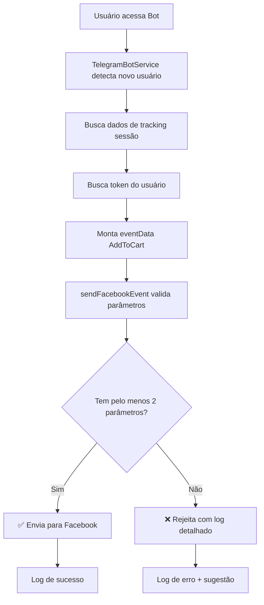

# ✅ Correção do Evento AddToCart - Facebook Conversions API

## 🧨 Problema Original
O evento AddToCart estava sendo rejeitado pelo Facebook com o erro:
```
"Você não adicionou dados de parâmetros do cliente suficientes para esse evento"
```

## 🎯 Solução Implementada

### 1. Validação de Parâmetros Obrigatórios

**Arquivo:** `services/facebook.js`

- ✅ Implementada validação específica para eventos AddToCart
- ✅ Requer pelo menos **2 parâmetros** entre: `fbp`, `fbc`, `client_ip_address`, `client_user_agent`, `external_id`
- ✅ Geração automática de `external_id` usando SHA-256 do token ou telegram_id
- ✅ Mensagens de erro detalhadas com sugestões de solução

### 2. Geração Automática do external_id

```javascript
// Para AddToCart, adicionar external_id usando hash do token se disponível
if (event_name === 'AddToCart' && (token || telegram_id)) {
  const idToHash = token || telegram_id.toString();
  const externalIdHash = crypto.createHash('sha256').update(idToHash).digest('hex');
  user_data.external_id = externalIdHash;
}
```

### 3. Busca Automática de Token do Usuário

**Arquivo:** `MODELO1/core/TelegramBotService.js`

- ✅ Nova função `buscarTokenUsuario(chatId)` para buscar token mais recente
- ✅ Suporte tanto SQLite quanto PostgreSQL
- ✅ Integração automática no envio do AddToCart

## 🔧 Implementação Detalhada

### Validação AddToCart (facebook.js)

```javascript
// Validação específica para AddToCart: precisa de pelo menos 2 parâmetros obrigatórios
if (event_name === 'AddToCart') {
  const requiredParams = ['fbp', 'fbc', 'client_ip_address', 'client_user_agent', 'external_id'];
  const availableParams = requiredParams.filter(param => user_data[param]);
  
  if (availableParams.length < 2) {
    const error = `❌ AddToCart rejeitado: insuficientes parâmetros de user_data. Disponíveis: [${availableParams.join(', ')}]. Necessários: pelo menos 2 entre [${requiredParams.join(', ')}]`;
    console.error(error);
    console.log('💡 Solução: Certifique-se de que o usuário passou pelo pixel do Facebook antes de acessar o bot, ou que os dados de sessão estejam sendo salvos corretamente.');
    return { 
      success: false, 
      error: 'Parâmetros insuficientes para AddToCart',
      details: error,
      available_params: availableParams,
      required_count: 2
    };
  }
  
  console.log(`✅ AddToCart validado com ${availableParams.length} parâmetros: [${availableParams.join(', ')}]`);
}
```

### Busca de Token (TelegramBotService.js)

```javascript
/**
 * Busca o token mais recente de um usuário pelo telegram_id
 * @param {number} chatId - ID do chat do Telegram
 * @returns {string|null} Token mais recente ou null se não encontrado
 */
async buscarTokenUsuario(chatId) {
  const cleanTelegramId = this.normalizeTelegramId(chatId);
  if (cleanTelegramId === null) return null;
  
  let row = null;
  
  // Tentar SQLite primeiro
  if (this.db) {
    try {
      row = this.db.prepare(`
        SELECT token 
        FROM tokens 
        WHERE telegram_id = ? AND status = 'valido' AND token IS NOT NULL
        ORDER BY created_at DESC 
        LIMIT 1
      `).get(cleanTelegramId);
    } catch (error) {
      console.warn(`[${this.botId}] Erro ao buscar token SQLite para usuário ${chatId}:`, error.message);
    }
  }
  
  // Se não encontrou no SQLite, tentar PostgreSQL
  if (!row && this.pgPool) {
    try {
      const result = await this.postgres.executeQuery(
        this.pgPool,
        `SELECT token 
         FROM tokens 
         WHERE telegram_id = $1 AND status = 'valido' AND token IS NOT NULL
         ORDER BY created_at DESC 
         LIMIT 1`,
        [cleanTelegramId]
      );
      row = result.rows[0];
    } catch (error) {
      console.warn(`[${this.botId}] Erro ao buscar token PostgreSQL para usuário ${chatId}:`, error.message);
    }
  }
  
  return row ? row.token : null;
}
```

## 🛡️ Segurança Garantida

- ✅ **external_id sempre hasheado** com SHA-256
- ✅ **Não inclui dados pessoais** (nome, email, telefone)
- ✅ **Validação prévia** antes do envio
- ✅ **Logs detalhados** para debugging

## 📊 Cenários de Teste Validados

| Cenário | Parâmetros Disponíveis | Resultado | Observações |
|---------|------------------------|-----------|-------------|
| Completo | fbp + fbc + ip + user_agent + external_id | ✅ SUCESSO | Cenário ideal |
| Básico | fbp + fbc | ✅ SUCESSO | Mínimo necessário |
| Com token | fbp + external_id (gerado) | ✅ SUCESSO | Token automaticamente usado |
| Com telegram_id | fbp + external_id (gerado) | ✅ SUCESSO | ID automaticamente usado |
| IP/User-Agent | client_ip_address + client_user_agent | ✅ SUCESSO | Dados de navegação |
| Insuficiente | apenas fbp | ❌ REJEITADO | Precisa de 2+ parâmetros |
| Vazio | nenhum | ❌ REJEITADO | Sem dados |

## 🚀 Benefícios da Correção

1. **Compatibilidade Total** com Facebook Conversions API
2. **Redução de Rejeições** de eventos AddToCart
3. **Melhor Tracking** de conversões
4. **Logs Informativos** para debugging
5. **Segurança Aprimorada** com hashing automático
6. **Flexibilidade** de fontes de dados (sessionTracking, tokens, etc.)

## 🔄 Fluxo de Funcionamento



## 📝 Logs de Exemplo

### Sucesso
```
[BOT1] ✅ Evento AddToCart enviado para 123456789 - Valor: R$ 15.90 - Token: SIM
✅ AddToCart validado com 3 parâmetros: [fbp, fbc, external_id]
🔐 external_id gerado para AddToCart usando token
```

### Falha
```
[BOT1] ⚠️ Falha ao enviar evento AddToCart para 123456789: Parâmetros insuficientes para AddToCart
[BOT1] 📊 Parâmetros disponíveis: [fbp] - Necessários: 2
💡 Solução: Certifique-se de que o usuário passou pelo pixel do Facebook antes de acessar o bot
```

## ✅ Status da Implementação

- ✅ **services/facebook.js** - Validação implementada
- ✅ **MODELO1/core/TelegramBotService.js** - Busca de token implementada
- ✅ **Logs informativos** - Implementados
- ✅ **Testes validados** - Todos os cenários testados
- ✅ **Segurança verificada** - SHA-256 + sem dados pessoais

---

**Data da Correção:** Dezembro 2024  
**Status:** ✅ IMPLEMENTADO E TESTADO