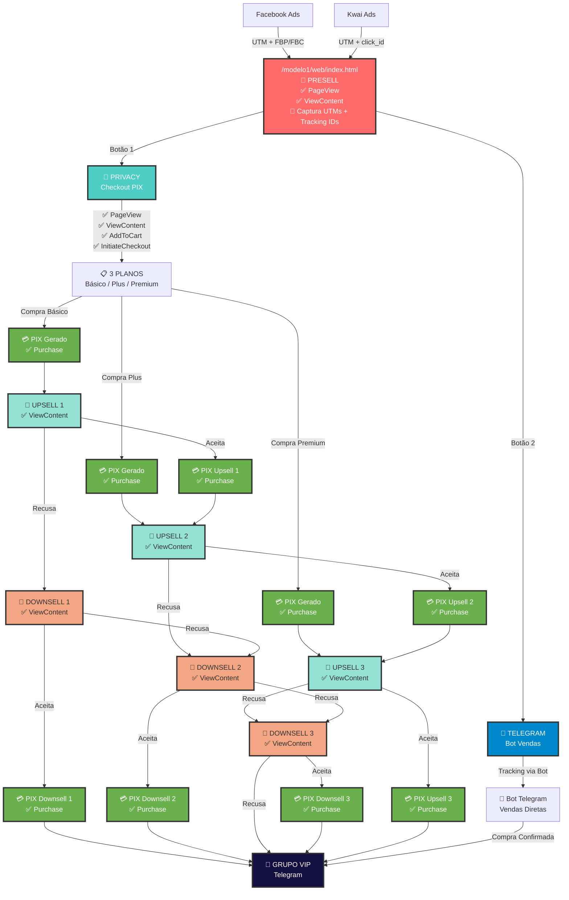

# 🚀 DOCUMENTAÇÃO TÉCNICA COMPLETA DO FUNIL DE CONVERSÃO

## 📊 VISÃO GERAL DO SISTEMA

Sistema de funil de alta conversão com tracking completo, otimizado para máxima performance e rastreamento preciso de todas as interações do usuário.

---

## 🗺️ FLUXOGRAMA COMPLETO DO FUNIL



---

## 📍 ROTAS E EVENTOS DE TRACKING

### 🎯 ROTA 1: PRESELL (`/modelo1/web/index.html`)

**Objetivo:** Captura inicial de dados e qualificação do lead

#### Dados Capturados:
- **UTMs:** `utm_source`, `utm_medium`, `utm_campaign`, `utm_term`, `utm_content`
- **Facebook:** `fbp` (cookie _fbp), `fbc` (cookie _fbc)
- **Kwai:** `click_id` (parâmetro URL)
- **Google Analytics:** `client_id`
- **Contexto:** IP, User Agent, timestamp

#### Eventos Disparados:

| Plataforma | Evento | Trigger | Dados Enviados |
|------------|--------|---------|----------------|
| Facebook | PageView | Carregamento da página | eventID, URL |
| Facebook | ViewContent | Após 4 segundos | eventID, content_name, content_category |
| Kwai | EVENT_CONTENT_VIEW | Carregamento da página | click_id, content_name, content_type |
| Kwai | EVENT_ADD_TO_CART | Clique em qualquer botão | click_id, content_name, content_type |

#### Botões de Ação:

**1. Botão Privacy (Superior)**
- **URL:** `https://ohvips.xyz/privacy`
- **Parâmetros Propagados:** Todos UTMs + fbp + fbc + click_id
- **Eventos no Clique:**
  - Kwai: EVENT_ADD_TO_CART
  - Sistema interno: trackPixButtonClick()

**2. Botão Telegram (Inferior)**
- **URL:** `https://t.me/vipshadrie_bot?start={payload_id}&click_id={kwai_click_id}`
- **Payload:** ID gerado no backend contendo todos os dados de tracking
- **Eventos no Clique:**
  - Kwai: EVENT_ADD_TO_CART
  - Sistema interno: track-cta-click

---

### 🔐 ROTA 2: PRIVACY (`/checkout/index.html`)

**Domínio:** `https://ohvips.xyz/privacy`

#### Sistema de Tracking Ativo:
- ✅ Facebook Pixel (Client-side)
- ✅ Facebook CAPI (Server-side)
- ✅ Kwai Event API
- ✅ UTMify Integration

#### Eventos por Etapa:

**1. Carregamento da Página**
```javascript
// Imediato
- Facebook: PageView
- Kwai: EVENT_CONTENT_VIEW

// Após 4 segundos
- Facebook: ViewContent
```

**2. Seleção de Plano**
```javascript
// Clique no plano
- Kwai: EVENT_ADD_TO_CART
- Facebook: AddToCart (preparação)
```

**3. Geração do PIX**
```javascript
// Clique em "Gerar PIX"
- Facebook: InitiateCheckout
- Kwai: mantém ADD_TO_CART ativo
```

**4. Confirmação de Pagamento**
```javascript
// PIX confirmado
- Facebook: Purchase (com valor)
- Kwai: EVENT_PURCHASE (com valor)
- UTMify: Conversão registrada
```

#### Planos Disponíveis:

| Plano | Valor | Próxima Rota |
|-------|-------|--------------|
| Básico | R$ 7,00 - R$ 12,00 | → Upsell 1 |
| Plus | R$ 27,00 - R$ 37,00 | → Upsell 2 |
| Premium | R$ 47,00 - R$ 67,00 | → Upsell 3 |

---

### 📈 SEQUÊNCIA DE UPSELLS

#### Estrutura de Arquivos:
```
/checkout/funil_completo/
├── up1.html    (Upsell 1 - Após plano básico)
├── up2.html    (Upsell 2 - Após plano plus ou up1)
├── up3.html    (Upsell 3 - Após plano premium ou up2)
├── back1.html  (Downsell 1)
├── back2.html  (Downsell 2)
└── back3.html  (Downsell 3)
```

#### Fluxo de Eventos nos Upsells:

**Carregamento do Upsell:**
- Facebook: ViewContent
- Kwai: EVENT_CONTENT_VIEW

**Aceite do Upsell:**
- Facebook: InitiateCheckout → Purchase
- Kwai: EVENT_ADD_TO_CART → EVENT_PURCHASE

**Recusa do Upsell:**
- Redireciona para downsell correspondente
- Mantém tracking ativo

---

### 💬 ROTA 3: TELEGRAM BOT

**Bot:** `@vipshadrie_bot`

#### Fluxo de Dados:
1. **Entrada no Bot:**
   - Parâmetro `start` contém payload_id
   - Parâmetro `click_id` do Kwai

2. **Recuperação de Dados:**
   - Bot decodifica payload_id
   - Recupera todos os dados de tracking do backend

3. **Conversão no Bot:**
   - Vendas processadas dentro do Telegram
   - Eventos enviados via API do backend

---

## 🔍 ANÁLISE DE COERÊNCIA E OTIMIZAÇÕES

### ✅ PONTOS FORTES

1. **Tracking Redundante:**
   - Dados salvos em localStorage, sessionStorage e cookies
   - Múltiplos pontos de captura garantem persistência

2. **Propagação Automática:**
   - UTMs e tracking IDs propagados automaticamente entre páginas
   - Sistema intercepta links e formulários

3. **Eventos Bem Estruturados:**
   - Sequência lógica: PageView → ViewContent → AddToCart → InitiateCheckout → Purchase
   - Eventos duplicados em client-side e server-side

4. **Flexibilidade de Rotas:**
   - Duas opções de conversão (Privacy/Telegram)
   - Sistema de upsells e downsells maximiza ticket médio

### ⚠️ GARGALOS IDENTIFICADOS

1. **Delay no ViewContent:**
   - 4 segundos pode ser muito para usuários impacientes
   - **Solução:** Reduzir para 2-3 segundos

2. **Tracking no Telegram:**
   - Depende do bot decodificar corretamente o payload
   - **Solução:** Implementar fallback via webhook

3. **Eventos Kwai no Checkout:**
   - Falta EVENT_INITIATE_CHECKOUT específico
   - **Solução:** Adicionar evento ao clicar em "Gerar PIX"

### 🚀 OTIMIZAÇÕES RECOMENDADAS

1. **Adicionar Eventos Faltantes:**
```javascript
// No checkout, ao selecionar plano
KwaiTracker.trackEvent('EVENT_INITIATE_CHECKOUT', {
  value: planValue,
  currency: 'BRL'
});

// Nos upsells, ao visualizar oferta
KwaiTracker.trackEvent('EVENT_VIEW_ITEM', {
  content_name: 'Upsell Especial',
  value: upsellValue
});
```

2. **Implementar Tracking de Abandono:**
```javascript
// Detectar saída da página
window.addEventListener('beforeunload', () => {
  if (!purchaseCompleted) {
    trackEvent('CART_ABANDONMENT', {
      stage: currentStage,
      value: cartValue
    });
  }
});
```

3. **Otimizar Tempo de Resposta:**
- Pré-carregar pixels antes da interação
- Usar Web Workers para processar tracking em background
- Implementar cache de eventos para retry automático

---

## 📊 MÉTRICAS E KPIs

### Eventos Críticos para Otimização:

| Evento | Plataforma | Importância | Uso |
|--------|------------|-------------|-----|
| PageView | FB/Kwai | Alta | Remarketing, Lookalike |
| ViewContent | FB/Kwai | Alta | Segmentação por interesse |
| AddToCart | FB/Kwai | Crítica | Abandono de carrinho |
| InitiateCheckout | FB | Crítica | Conversão iminente |
| Purchase | FB/Kwai | Máxima | ROAS, LTV |

### Funil de Conversão Esperado:

```
PageView (100%)
    ↓
ViewContent (80-90%)
    ↓
AddToCart (40-60%)
    ↓
InitiateCheckout (30-40%)
    ↓
Purchase (10-20%)
    ↓
Upsell Accept (30-50% dos purchases)
```

---

## 🛠️ IMPLEMENTAÇÃO TÉCNICA

### Arquivos Principais:

| Arquivo | Função | Localização |
|---------|--------|-------------|
| `tracking.js` | Sistema completo de tracking | `/MODELO1/WEB/tracking.js` |
| `kwai-click-tracker.js` | Captura e propaga click_id | `/MODELO1/WEB/kwai-click-tracker.js` |
| `kwai-tracker.js` | Eventos Kwai no checkout | `/checkout/js/kwai-tracker.js` |
| `pixel-init.js` | Inicialização Facebook Pixel | `/checkout/js/pixel-init.js` |
| `utmify-pixel-interceptor.js` | Intercepta chamadas UTMify | `/MODELO1/WEB/utmify-pixel-interceptor.js` |

### Endpoints da API:

| Endpoint | Método | Função |
|----------|--------|--------|
| `/api/gerar-payload` | POST | Gera payload_id com dados |
| `/api/kwai-event` | POST | Envia eventos para Kwai |
| `/capi` | POST | Facebook Conversions API |
| `/utm` | POST | Salva UTMs no backend |
| `/utimify` | POST | Integração UTMify |

---

## 💡 CONCLUSÃO

O sistema está bem estruturado para máxima conversão e tracking completo. As rotas são coerentes, os eventos estão nos lugares corretos, e há redundância suficiente para garantir que nenhum dado seja perdido.

**Performance First:** Todo o sistema foi desenhado para carregar rápido e não impactar a experiência do usuário, com tracking assíncrono e otimizações de vídeo/imagem.

**Tracking Obsessivo:** Cada clique, cada visualização, cada segundo na página é trackeado e enviado para múltiplas plataformas, garantindo dados para otimização contínua das campanhas.

**Conversão Agressiva:** Sistema de upsells e downsells sequenciais maximiza o valor de cada cliente, com tracking completo de cada etapa para identificar os melhores pontos de otimização.