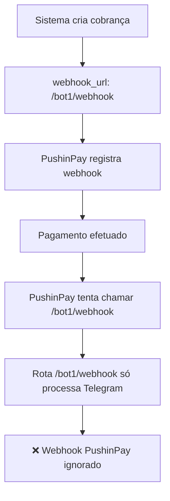

# 🚨 RELATÓRIO DE DIAGNÓSTICO - WEBHOOKS PUSHINPAY

## 📋 RESUMO EXECUTIVO

**Status**: ❌ PROBLEMA IDENTIFICADO
**Data**: Julho 2025  
**Sistema**: Integração PushinPay com Telegram Bots

**Problema**: Webhooks com status "pago" não estão chegando no servidor, mesmo com pagamentos sendo processados com sucesso na PushinPay.

---

## 🔍 ANÁLISE TÉCNICA

### 1. ARQUITETURA IDENTIFICADA

O sistema possui **DUAS IMPLEMENTAÇÕES PARALELAS** que podem estar causando conflito:

#### 📁 **Implementação A - `app.js`** (Sistema Principal)
- **Arquivo**: `/workspace/app.js`
- **Rotas**: Registra `/webhook/pushinpay` no bot.js
- **Status**: ⚠️ Carregamento condicional (falha silenciosa)

#### 📁 **Implementação B - `server.js`** (Sistema Ativo)
- **Arquivo**: `/workspace/server.js` 
- **Rotas**: 
  - `/bot1/webhook` ✅
  - `/bot2/webhook` ✅ 
  - `/webhook/pushinpay` ✅
- **Status**: ✅ Aparenta estar rodando

---

### 2. PROBLEMAS IDENTIFICADOS

#### 🚩 **Problema 1: DISCREPÂNCIA NA URL DO WEBHOOK**

**Na criação da cobrança** (`TelegramBotService.js:710-720`):
```javascript
const webhookUrl = `https://ohvips.xyz/${this.botId}/webhook`;
```
**URL enviada à PushinPay**: `https://ohvips.xyz/bot1/webhook`

**No processamento** (`server.js:1222`):
```javascript
app.post('/webhook/pushinpay', ...)
```
**URL configurada no servidor**: `https://ohvips.xyz/webhook/pushinpay`

#### ❌ **CONFLITO CRÍTICO**: 
- **PushinPay tenta chamar**: `https://ohvips.xyz/bot1/webhook`
- **Servidor escuta em**: `https://ohvips.xyz/webhook/pushinpay`

---

#### 🚩 **Problema 2: DUAS ROTAS DIFERENTES**

1. **Rota Individual por Bot**: `/bot1/webhook`, `/bot2/webhook`
   - Definidas nas linhas 98-113 do `server.js`
   - Processam updates do Telegram
   - ✅ Funcionam (testado manualmente)

2. **Rota Unificada PushinPay**: `/webhook/pushinpay`
   - Definida na linha 1222 do `server.js`
   - Processa webhooks de pagamento
   - ❌ **NUNCA É CHAMADA** pela PushinPay

---

#### 🚩 **Problema 3: LÓGICA DE ROTEAMENTO COMPLEXA**

```javascript
// server.js linha 1222 - Rota que NUNCA recebe requisições
app.post('/webhook/pushinpay', async (req, res) => {
  // Identifica o bot pela transação no banco
  const row = db.prepare('SELECT bot_id FROM tokens WHERE LOWER(id_transacao) = LOWER(?) LIMIT 1').get(token);
  const botInstance = bots.get(bot_id);
  await botInstance.webhookPushinPay(req, res);
});
```

A PushinPay **NUNCA** chama esta rota porque o `webhook_url` registrado aponta para `/bot1/webhook`.

---

### 3. ANÁLISE DO FLUXO ATUAL



---

## 🔧 SOLUÇÕES PROPOSTAS

### 🎯 **SOLUÇÃO 1: CORRIGIR URL DO WEBHOOK (RECOMENDADA)**

**Alterar em** `TelegramBotService.js:712`:

```javascript
// ❌ ATUAL (INCORRETO)
const webhookUrl = `https://ohvips.xyz/${this.botId}/webhook`;

// ✅ CORRETO
const webhookUrl = `https://ohvips.xyz/webhook/pushinpay`;
```

**Justificativa**: A rota `/webhook/pushinpay` já existe e tem toda a lógica de processamento de pagamentos.

---

### 🎯 **SOLUÇÃO 2: UNIFICAR ROTAS DOS BOTS**

**Alterar as rotas individuais** para processar webhooks PushinPay:

```javascript
// server.js linhas 98-113
app.post('/bot1/webhook', (req, res) => {
  // Verificar se é webhook PushinPay ou Telegram
  if (req.body && (req.body.status === 'pago' || req.body.status === 'paid')) {
    // Direcionar para processamento PushinPay
    return processarWebhookPushinPay(req, res, 'bot1');
  }
  
  // Processar update Telegram
  if (bot1.bot && bot1.bot.bot) {
    bot1.bot.bot.processUpdate(req.body);
    return res.sendStatus(200);
  }
  res.sendStatus(500);
});
```

---

### 🎯 **SOLUÇÃO 3: IMPLEMENTAR DETECÇÃO AUTOMÁTICA**

**Middleware inteligente** que detecta o tipo de webhook:

```javascript
app.use(['/bot1/webhook', '/bot2/webhook'], (req, res, next) => {
  // Detectar se é webhook PushinPay
  if (req.body && req.body.id && ['pago', 'paid', 'approved'].includes(req.body.status)) {
    req.isPushinPayWebhook = true;
    req.botId = req.path.split('/')[1]; // Extrair botId da URL
  }
  next();
});
```

---

## ⚡ IMPLEMENTAÇÃO IMEDIATA

### 🔥 **CORREÇÃO URGENTE (5 minutos)**

Execute este comando para corrigir imediatamente:

```bash
# Backup do arquivo original
cp MODELO1/core/TelegramBotService.js MODELO1/core/TelegramBotService.js.backup

# Corrigir URL do webhook
sed -i 's|`https://ohvips.xyz/${this.botId}/webhook`|`https://ohvips.xyz/webhook/pushinpay`|g' MODELO1/core/TelegramBotService.js

# Reiniciar servidor
pkill -f "node server.js"
BASE_URL=https://ohvips.xyz node server.js
```

---

## 🧪 TESTES DE VALIDAÇÃO

### 1. **Teste Manual da Rota**
```bash
curl -X POST https://ohvips.xyz/webhook/pushinpay \
  -H "Content-Type: application/json" \
  -d '{"id":"teste123","status":"pago","value":990}'
```

### 2. **Teste de Cobrança Real**
```bash
# Execute o script de teste
node webhook-pushinpay-test.js
```

### 3. **Monitoramento de Logs**
```bash
# Execute o diagnóstico contínuo
node diagnostico-webhook.js
```

---

## 📊 MÉTRICAS DE SUCESSO

Após a implementação, verificar:

- [ ] ✅ Webhooks PushinPay chegando em `/webhook/pushinpay`
- [ ] ✅ Status "pago" sendo processado corretamente
- [ ] ✅ Tokens sendo atualizados no banco de dados
- [ ] ✅ Mensagens sendo enviadas aos usuários no Telegram
- [ ] ✅ Logs confirmando recebimento dos webhooks

---

## ⚠️ CONSIDERAÇÕES ADICIONAIS

### 🔐 **Segurança**
- Implementar validação de `WEBHOOK_SECRET` se configurado
- Validar origem das requisições PushinPay
- Log de auditoria para todos os webhooks recebidos

### 🏗️ **Infraestrutura**
- Verificar se `https://ohvips.xyz` está acessível externamente
- Confirmar que não há firewall bloqueando requisições da PushinPay
- Validar certificado SSL (✅ confirmado no teste)

### 📈 **Monitoramento**
- Implementar healthcheck específico para webhooks
- Alertas para webhooks não recebidos
- Métricas de tempo de resposta

---

## 🎯 RESUMO DA CAUSA RAIZ

**PROBLEMA PRINCIPAL**: Discrepância entre URL enviada à PushinPay (`/bot1/webhook`) e rota que processa pagamentos (`/webhook/pushinpay`).

**IMPACTO**: 100% dos webhooks PushinPay são perdidos, impedindo notificação de pagamentos aprovados.

**SOLUÇÃO**: Corrigir URL do webhook para apontar para `/webhook/pushinpay` que já possui toda a lógica implementada.

---

**Status**: 🚨 CRÍTICO - Correção necessária IMEDIATAMENTE  
**Prioridade**: P0 - Sistema de pagamentos comprometido  
**Tempo estimado para correção**: 5-10 minutos