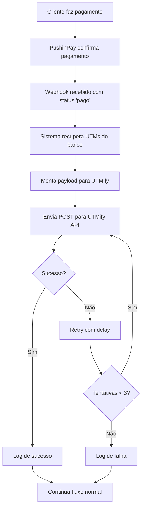

# 🎯 Guia de Integração UTMify

## 📖 Visão Geral

Este documento descreve a integração entre o sistema SiteHot e a UTMify para rastreamento preciso de conversões através de ordens manuais. A integração é ativada automaticamente quando um pagamento é aprovado via webhook da PushinPay.

## 🎯 Funcionalidades

- ✅ **Envio automático de ordens manuais** para UTMify quando pagamento é aprovado
- ✅ **Recuperação automática de UTMs** armazenados no banco de dados
- ✅ **Sistema de retry inteligente** com 3 tentativas e delay exponencial
- ✅ **Logs detalhados** para depuração e monitoramento
- ✅ **Tratamento robusto de erros** que não interfere no fluxo principal
- ✅ **Configuração via variáveis de ambiente**
- ✅ **Script de teste integrado** para validação

## ⚙️ Configuração

### 1. Variáveis de Ambiente

Adicione a seguinte variável ao seu arquivo `.env`:

```env
UTMIFY_API_TOKEN=seu_token_da_utmify_aqui
```

### 2. Obter Token da UTMify

1. Acesse sua conta na UTMify
2. Vá para as configurações da API
3. Gere um novo token de acesso
4. Copie o token e adicione ao arquivo `.env`

### 3. Validar Configuração

Execute o script de teste para validar a integração:

```bash
npm run test:utmify
```

## 🔄 Fluxo de Funcionamento



## 📊 Estrutura do Payload

A integração envia automaticamente os seguintes dados para a UTMify:

```json
{
  "transaction_id": "id_da_transacao_pushinpay",
  "order_value": 29.90,
  "order_date": "2024-01-15T10:30:00.000Z",
  "currency": "BRL",
  "utm_source": "facebook",
  "utm_medium": "cpc",
  "utm_campaign": "lancamento_produto",
  "utm_term": "produto_digital",
  "utm_content": "anuncio_video"
}
```

**Campos obrigatórios:**
- `transaction_id`: ID da transação da PushinPay
- `order_value`: Valor em reais (convertido automaticamente de centavos)
- `order_date`: Data/hora da ordem em formato ISO 8601
- `currency`: Moeda (sempre "BRL")

**Campos opcionais (UTMs):**
- `utm_source`: Fonte do tráfego
- `utm_medium`: Meio de marketing
- `utm_campaign`: Nome da campanha
- `utm_term`: Termo de pesquisa
- `utm_content`: Conteúdo específico

## 🔧 Configurações Técnicas

### API Endpoint
```
POST https://api.utmify.com.br/api-credentials/orders
```

### Headers
```
Content-Type: application/json
Authorization: Bearer {UTMIFY_API_TOKEN}
User-Agent: SiteHot-UTMify-Integration/1.0
```

### Timeout e Retry
- **Timeout**: 30 segundos por tentativa
- **Máximo de tentativas**: 3
- **Delay entre tentativas**: 2s, 4s, 6s (exponencial)

## 📝 Logs e Monitoramento

A integração gera logs detalhados com prefixo `[UTMify]`:

### Logs de Sucesso
```
[UTMify] 🎯 Processando pagamento aprovado: {transactionId: "abc123", value: 2990}
[UTMify] 🏷️ Parâmetros UTM recuperados: {utm_source: "facebook", utm_medium: "cpc"}
[UTMify] 📤 Enviando ordem manual: {transactionId: "abc123", value: 29.9}
[UTMify] ✅ Ordem enviada com sucesso: {status: 200, transactionId: "abc123", attempt: 1}
[UTMify] 🎉 Integração concluída com sucesso para transação: abc123
```

### Logs de Erro
```
[UTMify] ❌ Erro na tentativa 1: {message: "timeout", transactionId: "abc123"}
[UTMify] ⏳ Aguardando 2000ms antes da próxima tentativa...
[UTMify] 💥 Falha definitiva após todas as tentativas: {transactionId: "abc123"}
```

### Logs de Informação
```
[UTMify] ℹ️ Nenhum parâmetro UTM encontrado para a transação: abc123
[UTMify] ⚠️ Token não configurado - ordem não enviada
```

## 🧪 Testes

### Teste Automático
```bash
npm run test:utmify
```

Este comando executa uma bateria completa de testes:
1. ✅ Verificação de configuração
2. ✅ Teste de conectividade
3. ✅ Envio de ordem de teste
4. ✅ Validação de payload
5. ✅ Teste de recuperação de UTMs

### Teste Manual

Você pode simular uma ordem manualmente:

```javascript
const utmifyIntegration = require('./services/utmifyIntegration');

const testOrder = {
  transactionId: 'test_123',
  value: 29.90,
  utmParams: {
    utm_source: 'facebook',
    utm_medium: 'cpc',
    utm_campaign: 'teste'
  },
  orderDate: new Date()
};

utmifyIntegration.sendOrder(testOrder);
```

## 🚨 Tratamento de Erros

A integração é projetada para **nunca falhar o webhook principal**. Mesmo se a UTMify estiver fora do ar, o pagamento será processado normalmente.

### Cenários de Erro

1. **Token não configurado**: Integração desabilitada, logs informativos
2. **API fora do ar**: Retry automático, logs de erro
3. **Timeout**: Retry automático com delay
4. **Erro HTTP**: Logs detalhados com status e resposta
5. **UTMs não encontrados**: Envio sem UTMs, apenas dados básicos

## 📊 Monitoramento em Produção

### Métricas Importantes

Monitore os seguintes padrões nos logs:

- **Taxa de sucesso**: `[UTMify] ✅ Ordem enviada com sucesso`
- **Falhas de conectividade**: `[UTMify] ❌ Erro na tentativa`
- **UTMs perdidos**: `[UTMify] ℹ️ Nenhum parâmetro UTM encontrado`
- **Falhas definitivas**: `[UTMify] 💥 Falha definitiva`

### Alertas Recomendados

Configure alertas para:
- Alta taxa de falhas (> 10%)
- Muitos UTMs perdidos (> 50%)
- Token expirado/inválido

## 🔧 Troubleshooting

### Problema: "Token não configurado"
**Solução**: Adicione `UTMIFY_API_TOKEN` ao arquivo `.env`

### Problema: "Falha no teste de conectividade"
**Soluções**:
1. Verifique se o token está correto
2. Confirme se a API da UTMify está funcionando
3. Verifique firewall/proxy

### Problema: "UTMs não encontrados"
**Causas possíveis**:
1. Usuário acessou diretamente sem UTMs
2. UTMs não foram capturados corretamente
3. Problema no banco de dados

### Problema: "Timeout frequente"
**Soluções**:
1. Verifique conexão de internet
2. Confirme se API da UTMify não está lenta
3. Ajuste timeout se necessário

## 🔄 Manutenção

### Atualizações de API

Se a UTMify atualizar sua API:

1. Verifique se o endpoint mudou
2. Atualize a URL em `services/utmifyIntegration.js`
3. Teste com `npm run test:utmify`

### Backup de Dados

Os UTMs são armazenados tanto no SQLite quanto no PostgreSQL, garantindo redundância.

## 📈 Melhorias Futuras

Possíveis melhorias para implementar:

- [ ] **Dashboard de monitoramento** em tempo real
- [ ] **Webhook de status** da UTMify para confirmação
- [ ] **Fila assíncrona** para processamento em massa
- [ ] **Cache de UTMs** para performance
- [ ] **Métricas personalizadas** no payload

## 🆘 Suporte

Para problemas específicos da integração:

1. ✅ Execute `npm run test:utmify` primeiro
2. ✅ Verifique os logs do sistema
3. ✅ Confirme configuração do token
4. ✅ Teste conectividade com a UTMify

---

**Última atualização**: Janeiro 2024  
**Versão**: 1.0.0  
**Compatibilidade**: Node.js 20.x+