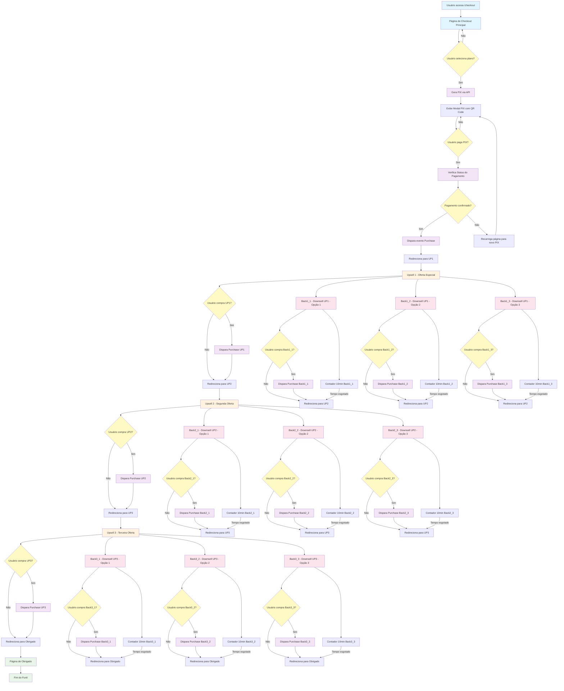

# Fluxo de Redirecionamento do Checkout - Sistema Avançado

## Diagrama do Fluxo Completo com Downsells Específicos



## Detalhes do Fluxo - Sistema Avançado

### 1. **Página Principal de Checkout** (`/checkout`)
- Usuário seleciona plano de pagamento
- Gera PIX via API `/api/gerar-pix-checkout`
- Exibe modal com QR Code e chave PIX
- Verifica status do pagamento periodicamente

### 2. **Funil de Upsells** (Ofertas Adicionais)
- **UP1** (`/checkout/funil_completo/up1.html?g=1`)
  - Primeira oferta especial
  - **Se comprar**: Redireciona para UP2
  - **Se não comprar**: 3 opções de downsell específicas

- **UP2** (`/checkout/funil_completo/up2.html`)
  - Segunda oferta especial
  - **Se comprar**: Redireciona para UP3
  - **Se não comprar**: 3 opções de downsell específicas

- **UP3** (`/checkout/funil_completo/up3.html`)
  - Terceira oferta especial
  - **Se comprar**: Redireciona para Obrigado
  - **Se não comprar**: 3 opções de downsell específicas

### 3. **Sistema de Downsells Específicos** (9 páginas de recuperação)

#### **Downsells do UP1** (3 opções)
- **Back1_1** (`/checkout/funil_completo/back1_1.html`)
  - Primeira opção de downsell para quem não comprou UP1
  - Contador de 10 minutos
  - Redireciona para UP2 após tempo ou compra

- **Back1_2** (`/checkout/funil_completo/back1_2.html`)
  - Segunda opção de downsell para quem não comprou UP1
  - Contador de 10 minutos
  - Redireciona para UP2 após tempo ou compra

- **Back1_3** (`/checkout/funil_completo/back1_3.html`)
  - Terceira opção de downsell para quem não comprou UP1
  - Contador de 10 minutos
  - Redireciona para UP2 após tempo ou compra

#### **Downsells do UP2** (3 opções)
- **Back2_1** (`/checkout/funil_completo/back2_1.html`)
  - Primeira opção de downsell para quem não comprou UP2
  - Contador de 10 minutos
  - Redireciona para UP3 após tempo ou compra

- **Back2_2** (`/checkout/funil_completo/back2_2.html`)
  - Segunda opção de downsell para quem não comprou UP2
  - Contador de 10 minutos
  - Redireciona para UP3 após tempo ou compra

- **Back2_3** (`/checkout/funil_completo/back2_3.html`)
  - Terceira opção de downsell para quem não comprou UP2
  - Contador de 10 minutos
  - Redireciona para UP3 após tempo ou compra

#### **Downsells do UP3** (3 opções)
- **Back3_1** (`/checkout/funil_completo/back3_1.html`)
  - Primeira opção de downsell para quem não comprou UP3
  - Contador de 10 minutos
  - Redireciona para Obrigado após tempo ou compra

- **Back3_2** (`/checkout/funil_completo/back3_2.html`)
  - Segunda opção de downsell para quem não comprou UP3
  - Contador de 10 minutos
  - Redireciona para Obrigado após tempo ou compra

- **Back3_3** (`/checkout/funil_completo/back3_3.html`)
  - Terceira opção de downsell para quem não comprou UP3
  - Contador de 10 minutos
  - Redireciona para Obrigado após tempo ou compra

### 4. **Página Final** (`/checkout/obrigado`)
- Confirmação de pagamento
- Fim do funil de vendas

## Características Importantes - Sistema Avançado

- **Sistema de Downsells Específicos**: 9 páginas de recuperação (3 para cada upsell)
- **Tracking Completo**: Cada compra dispara eventos de Purchase para Facebook/Kwai
- **Preservação de Parâmetros**: UTMs e dados de tracking são mantidos em todo o fluxo
- **Contadores de Tempo**: Cada downsell tem contador de 10 minutos
- **Fallbacks**: Sistema robusto com redirecionamentos mesmo em caso de erro
- **Responsivo**: Todas as páginas são otimizadas para mobile
- **Personalização**: Ofertas específicas baseadas no comportamento do usuário

## Estrutura de Arquivos Necessária

```
checkout/funil_completo/
├── up1.html (Upsell 1)
├── up2.html (Upsell 2)
├── up3.html (Upsell 3)
├── back1_1.html (Downsell UP1 - Opção 1)
├── back1_2.html (Downsell UP1 - Opção 2)
├── back1_3.html (Downsell UP1 - Opção 3)
├── back2_1.html (Downsell UP2 - Opção 1)
├── back2_2.html (Downsell UP2 - Opção 2)
├── back2_3.html (Downsell UP2 - Opção 3)
├── back3_1.html (Downsell UP3 - Opção 1)
├── back3_2.html (Downsell UP3 - Opção 2)
├── back3_3.html (Downsell UP3 - Opção 3)
└── assets/
    ├── up1.mp4, up2.mp4, up3.mp4
    ├── back1_1.mp4, back1_2.mp4, back1_3.mp4
    ├── back2_1.mp4, back2_2.mp4, back2_3.mp4
    └── back3_1.mp4, back3_2.mp4, back3_3.mp4
```

## Tecnologias Utilizadas

- **Frontend**: HTML5, CSS3, JavaScript, Bootstrap
- **Tracking**: Facebook Pixel, Kwai Events API, UTMify
- **Pagamentos**: PIX via API externa
- **Estilização**: Gradientes, animações CSS, SweetAlert2
- **Lógica**: Sistema de roteamento inteligente baseado em comportamento
