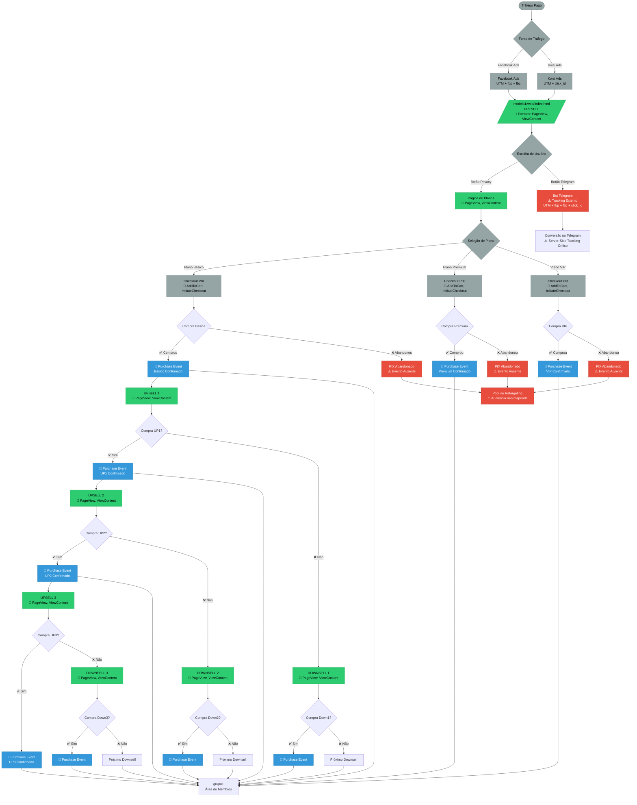

# Fluxograma do Funil de Conversão

## Legenda:
- 🟢 **Verde**: Páginas com tracking implementado
- 🔴 **Vermelho**: Pontos críticos sem tracking adequado
- 🔵 **Azul**: Eventos de conversão
- ⚠️ **Alerta**: Possível gargalo ou evento ausente